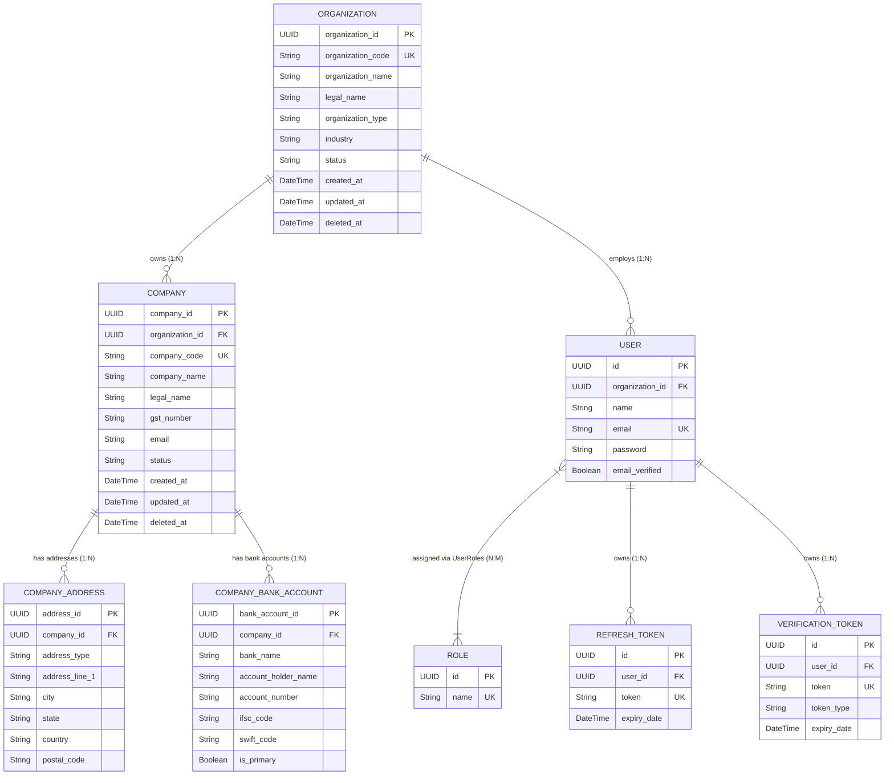

# Entity Relationship Diagram

Here is the complete graphical representation of our database architecture for the Enterprise Tenant system.

```mermaid
erDiagram
    %% Core Tenant Entities
    ORGANIZATION ||--o{ COMPANY : "owns (1:N)"
    ORGANIZATION ||--o{ USER : "employs (1:N)"
    
    %% Company Details
    COMPANY ||--o{ COMPANY_ADDRESS : "has addresses (1:N)"
    COMPANY ||--o{ COMPANY_BANK_ACCOUNT : "has bank accounts (1:N)"

    %% User & Auth Entities
    USER }|--|{ ROLE : "assigned via UserRoles (N:M)"
    USER ||--o{ REFRESH_TOKEN : "owns (1:N)"
    USER ||--o{ VERIFICATION_TOKEN : "owns (1:N)"

    %% Table Definitions
    ORGANIZATION {
        UUID organization_id PK
        String organization_code UK
        String organization_name
        String legal_name
        String organization_type
        String industry
        String status
        DateTime created_at
        DateTime updated_at
        DateTime deleted_at
    }

    COMPANY {
        UUID company_id PK
        UUID organization_id FK
        String company_code UK
        String company_name
        String legal_name
        String gst_number
        String email
        String status
        DateTime created_at
        DateTime updated_at
        DateTime deleted_at
    }

    COMPANY_ADDRESS {
        UUID address_id PK
        UUID company_id FK
        String address_type
        String address_line_1
        String city
        String state
        String country
        String postal_code
    }

    COMPANY_BANK_ACCOUNT {
        UUID bank_account_id PK
        UUID company_id FK
        String bank_name
        String account_holder_name
        String account_number
        String ifsc_code
        String swift_code
        Boolean is_primary
    }

    USER {
        UUID id PK
        UUID organization_id FK
        String name
        String email UK
        String password
        Boolean email_verified
    }

    ROLE {
        UUID id PK
        String name UK
    }

    REFRESH_TOKEN {
        UUID id PK
        UUID user_id FK
        String token UK
        DateTime expiry_date
    }

    VERIFICATION_TOKEN {
        UUID id PK
        UUID user_id FK
        String token UK
        String token_type
        DateTime expiry_date
    }
```
