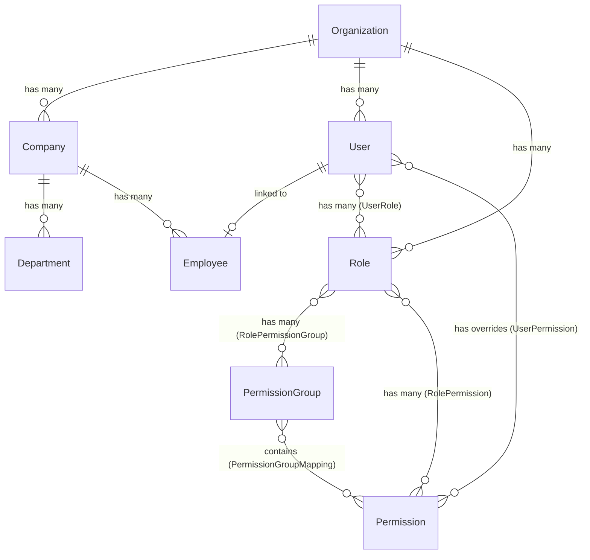

# InvoiceIQ Database Schema

This document outlines the core database schema, entity relationships, and table structures that drive the InvoiceIQ platform. It serves as a reference for Database Administrators and Backend Developers.

## 1. Entity Relationship Diagram (ERD)

The following diagram illustrates the high-level relationships between the core entities in the system.

## 2. Core Entities

### 2.1 Multi-Tenancy Hierarchy
| Entity | Description | Key Relationships |
| :--- | :--- | :--- |
| **`Organization`** | The top-level tenant in the system. | 1:M with `Company`, `User`, `Role`, `Department`, `Setting` |
| **`Company`** | A subsidiary or branch under an Organization. | M:1 with `Organization`. 1:M with `Employee`, `Department` |

### 2.2 Identity & Access Management (IAM)
| Entity | Description | Key Relationships |
| :--- | :--- | :--- |
| **`User`** | The authentication record for a human. Contains credentials. | M:1 with `Organization`, `Company`. 1:1 with `Employee`. |
| **`Role`** | A configurable job function (e.g., "Sales Manager"). | M:1 with `Organization`. M:M with `User`, `Permission`, `PermissionGroup` |
| **`Permission`** | A granular, hard-coded action (e.g., `customer.create`). | M:M with `Role`, `User`, `PermissionGroup` |
| **`PermissionGroup`** | A logical bundle of Permissions for easier assignment. | M:M with `Role`, `Permission` |
| **`UserRole`** | Join table linking Users to Roles. | - |
| **`RolePermission`** | Join table linking Roles directly to Permissions. | - |
| **`RolePermissionGroup`**| Join table linking Roles to PermissionGroups. | - |
| **`UserPermission`** | Join table linking Users directly to Permissions (Overrides). | - |
| **`PermissionGroupMapping`**| Join table linking PermissionGroups to specific Permissions. | - |

### 2.3 HR & Employee Management
| Entity | Description | Key Relationships |
| :--- | :--- | :--- |
| **`Employee`** | The HR profile of a User (Name, Designation, Salary info). | 1:1 with `User`. M:1 with `Company`, `Department`, `Designation` |
| **`Department`** | A business unit within a Company. Can be hierarchical. | M:1 with `Company`. 1:1 with parent `Department` |
| **`Designation`**| A job title within the Organization/Company. | M:1 with `Company`. 1:M with `Employee` |

### 2.4 System & Audit
| Entity | Description | Key Relationships |
| :--- | :--- | :--- |
| **`AuditLog`** | Immutable record of critical system actions (e.g., Role Created). | Links to `userId`, `organizationId` |
| **`Setting`** | Key-Value configuration settings for an Organization. | M:1 with `Organization` |

## 3. Data Integrity & Constraints

### 3.1 Organization Enforcement
- Every custom Role, Department, Employee, User, and Designation **must** belong to an Organization. The `organization_id` column is strictly enforced (`nullable = false`).
- A User cannot be assigned a Role that belongs to a different Organization.

### 3.2 Cascading Deletions
- Deleting an `Organization` cascades down to delete all child `Companies`, `Users`, `Roles`, and `Settings`.
- Deleting a `Role` cascades to delete all `UserRole` mapping records, ensuring no orphaned associations exist in the join tables.
