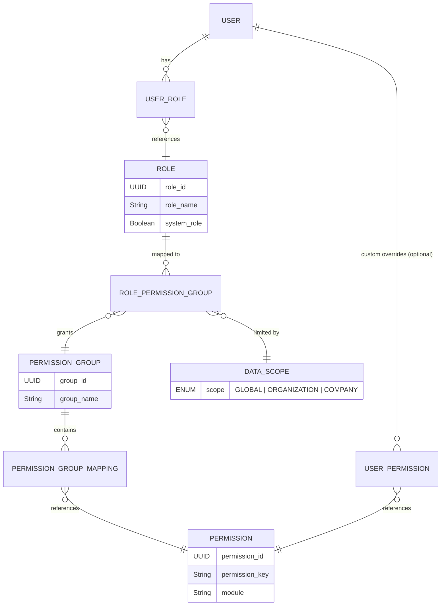
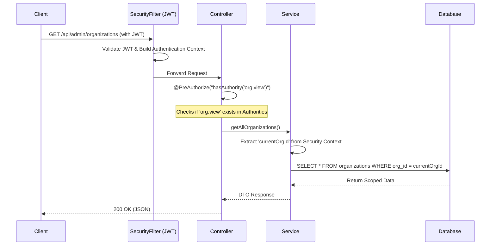

# Role-Based Access Control (RBAC) & Permissions Architecture

## Overview
InvoiceIQ utilizes a highly granular, hybrid Role-Based Access Control (RBAC) and Attribute-Based Access Control (ABAC) architecture. This system shifts away from hardcoded roles (e.g., `hasRole('ROLE_SUPER_ADMIN')`) to dynamic, permission-based access control (e.g., `hasAuthority('org.view')`). 

This allows maximum flexibility: an administrator can define custom roles, attach specific permission groups to them, and restrict access based on "Data Scopes" (Global, Organization, or Company level).

## 1. Entity Relationship Diagram



## 2. Core Components

### A. Roles
A **Role** (e.g., `ROLE_SUPER_ADMIN`, `ROLE_COMPANY_ADMIN`) is simply a logical container. It does not possess any innate privileges in the codebase. Instead, privileges are dynamically assigned to a Role via Permission Groups.

### B. Permissions
A **Permission** represents the smallest granular action a user can take in the system. They are identified by `permissionKey`.
*Examples:* `org.view`, `org.edit`, `setting.view`, `invoice.create`.

### C. Permission Groups
To avoid assigning hundreds of individual permissions to a Role, permissions are clustered into **Permission Groups** (e.g., `Organization Management`, `Finance Operations`). 

### D. Data Scope (ABAC element)
When a Permission Group is mapped to a Role (`RolePermissionGroup`), it is assigned a **Data Scope**:
1. **GLOBAL**: Unrestricted system-wide access (Super Admin).
2. **ORGANIZATION**: Access limited to the user's specific Organization (Org Admin).
3. **COMPANY**: Access limited to the user's specific Company/Branch (Company Admin).

## 3. How Authentication Works (JWT Flow)

1. **Login**: The user provides credentials to `/api/auth/login`.
2. **Validation**: Spring Security's `AuthenticationManager` verifies the credentials using `UserDetailsServiceImpl`.
3. **Authority Aggregation**: During this process, `PermissionService.getUserAuthorities(userId)` executes a bulk, optimized database query to aggregate every single permission the user has access to.
   - It fetches `User -> UserRole -> Role -> RolePermissionGroup -> PermissionGroup -> Permission`.
   - It maps the resulting `permissionKey` strings (e.g., `org.view`) into a flat list of Spring Security `GrantedAuthority` objects.
4. **JWT Generation**: The system signs a JWT containing the user's ID, Org ID, and Company ID. The list of `GrantedAuthority` strings is either stored in the JWT or loaded natively from the DB on subsequent requests.

## 4. How Authorization Works (Access Control)

### Controller Level Security
Endpoints are protected using Spring Security's `@PreAuthorize` annotation, which evaluates the `GrantedAuthority` list of the currently authenticated user context.

```java
// Requires the user to have the specific granular permission
@PreAuthorize("hasAuthority('org.create')")
@PostMapping("/organizations")
public ResponseEntity<Organization> createOrganization(...) { ... }

// Allows access if the user has ANY of the specified permissions
@PreAuthorize("hasAnyAuthority('org.view', 'setting.view')")
@GetMapping("/company/profile")
public ResponseEntity<Company> getMyCompanyProfile(...) { ... }
```

### Data Scope Filtering (Business Logic Level)
Having the `org.view` permission only guarantees the user is *allowed* to view organizations. It does not dictate *which* organizations they can view.
To enforce Data Scopes, `SecurityUtils.java` is used inside service layer methods to extract the user's contextual scope IDs.

```java
// Example Scope Enforcement in a Service Class
public Company getCompanyById(UUID companyId) {
    UUID currentOrgId = SecurityUtils.getCurrentOrganizationId(); // Extracted from JWT context
    
    Company company = companyRepository.findById(companyId);
    
    // Authorization Check: Does this company belong to the user's organization scope?
    if (!company.getOrganization().getId().equals(currentOrgId)) {
        throw new AccessDeniedException("You do not have access to this company.");
    }
    
    return company;
}
```

## 5. Summary of the Request Lifecycle


